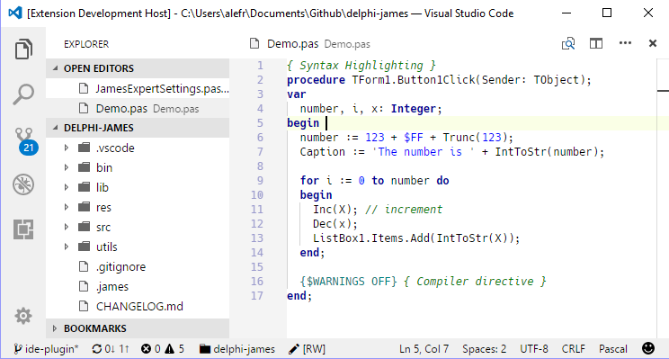
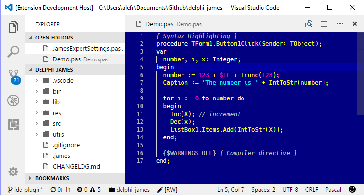
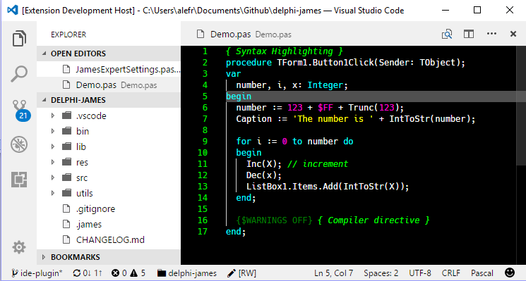
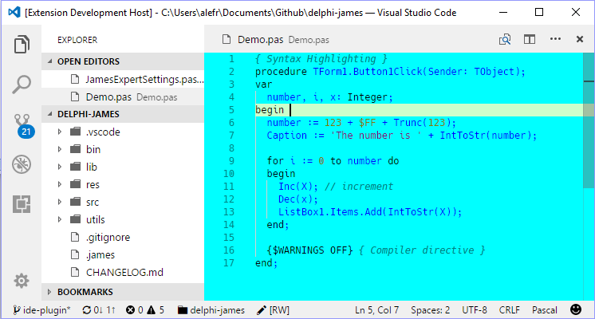

# Delphi Themes for Visual Studio Code

Make Visual Studio Code appear like Delphi.

A set of themes inspired by the original Delphi colors, specially crafted for the [Pascal Language](https://marketplace.visualstudio.com/items?itemName=alefragnani.pascal) extension.

## Screenshots

### Default

### Classic

### Twilight

### Ocean

# License

[MIT](LICENSE.md) &copy; Alessandro Fragnani

---

 a :coffee: if you enjoy using this extension :thumbsup: