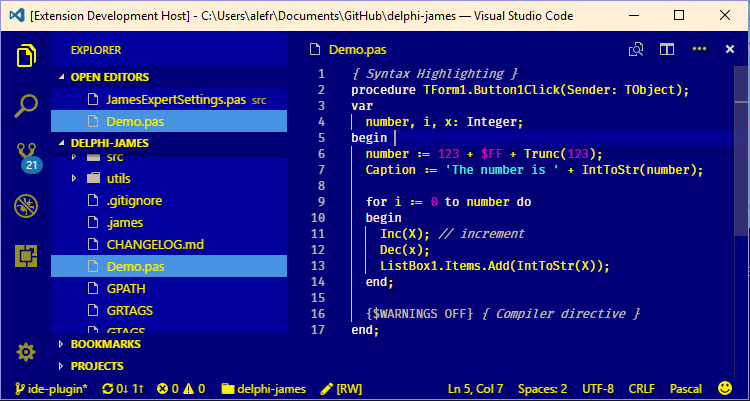
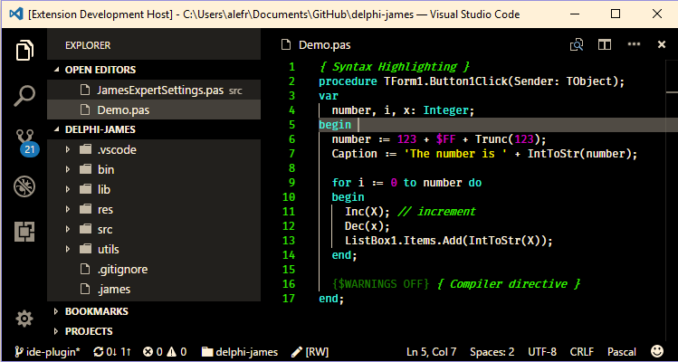
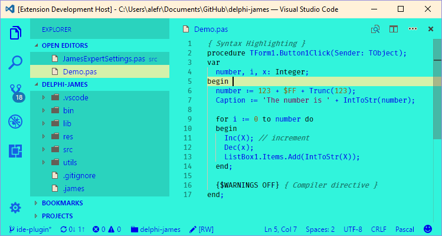

# Delphi Themes for Visual Studio Code

Make Visual Studio Code look like Delphi.

A set of themes inspired by the original Delphi colors, specially crafted for the [Pascal](https://marketplace.visualstudio.com/items?itemName=alefragnani.pascal) extension.

## Screenshots

### Default

### Classic

### Twilight

### Ocean

## Plus Themes

### Classic+

### Twilight+

### Ocean+

# Support

While **Delphi Themes** is free and open source, if you find it useful, please consider supporting it.

I've been working on this on my spare time, and although I enjoy giving away my free time and attention to it, I'd like to do more.

<table align="center" width="60%" border="0">
  <tr>
    <td>
      
    </td>
    <td>
      
    </td>
    <td>
      
    </td>
  </tr>
</table>

---

# License

[MIT](LICENSE.md) &copy; Alessandro Fragnani